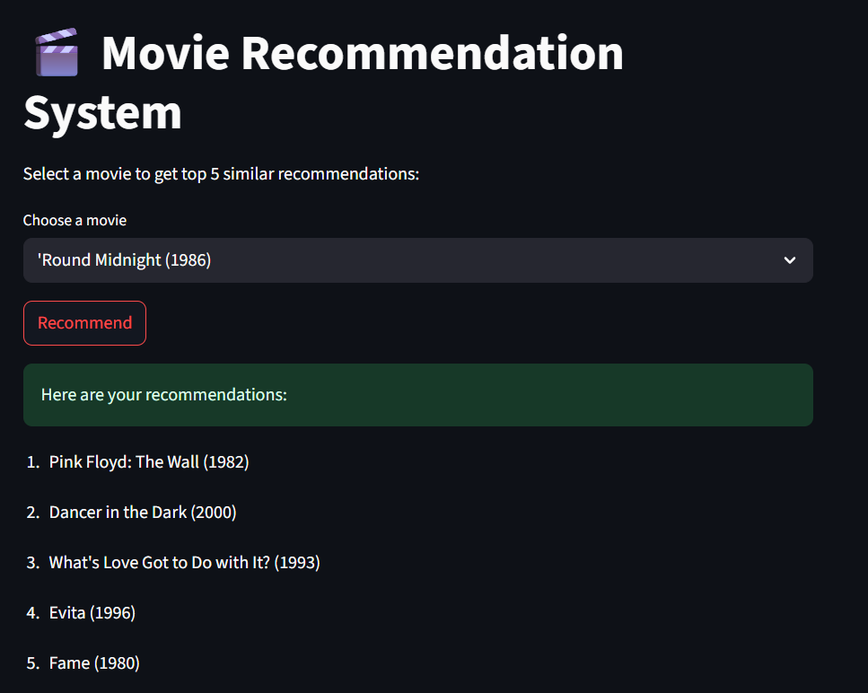

# Movie Recommendation System

A simple and interactive **Content-Based Movie Recommender System** built using Python and Streamlit.  
It recommends movies based on genre similarity and viewer engagement.

---

## Features

- Top 5 movie recommendations based on input movie
- Uses content-based filtering with TF-IDF & Cosine Similarity
- Ranking boosted using popularity (number of ratings)
- Clean Streamlit UI

---

## Live Demo

🔗 [Click here to try the app](https://movie-recommender-new.streamlit.app/)



---

## Dataset Used

- [MovieLens Small Dataset (100k)](https://grouplens.org/datasets/movielens/)
- Files used:
  - `movies.csv` — movie titles & genres
  - `ratings.csv` — user ratings

---

## Recommender Logic

- Extract genres from each movie
- Apply **TF-IDF vectorization** on genres
- Compute **cosine similarity**
- Multiply similarity with `log(1 + number of ratings)` to rank

---

## Tech Stack

- Python
- Pandas, NumPy, scikit-learn
- Streamlit

---

## 🧪 Run Locally

1. Clone this repo:
   ```bash
   git clone https://github.com/your-username/movie-recommender
   cd movie-recommender
